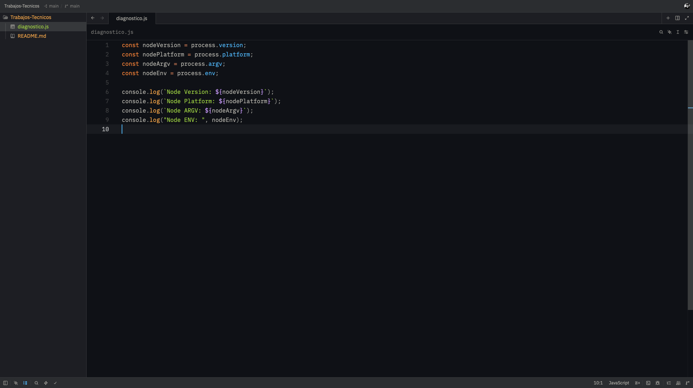
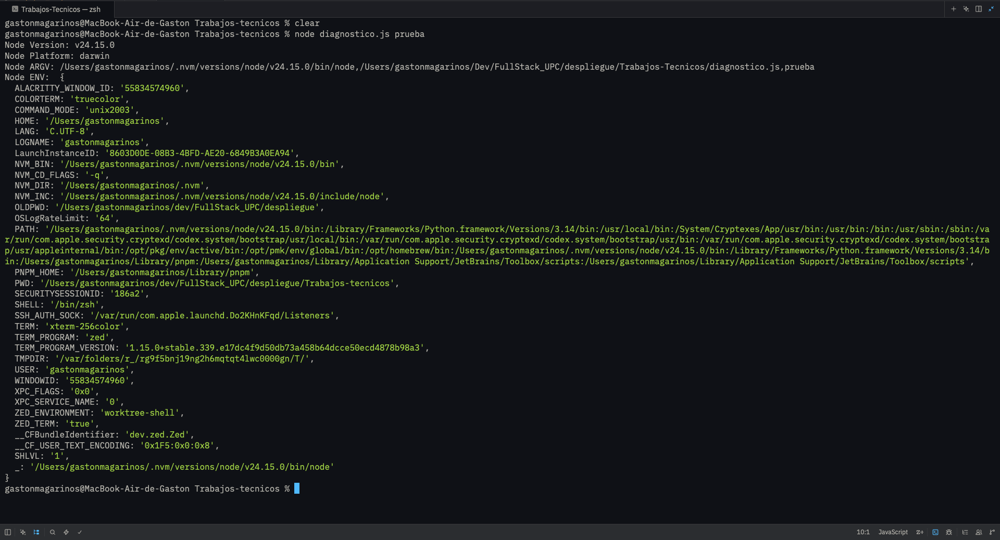
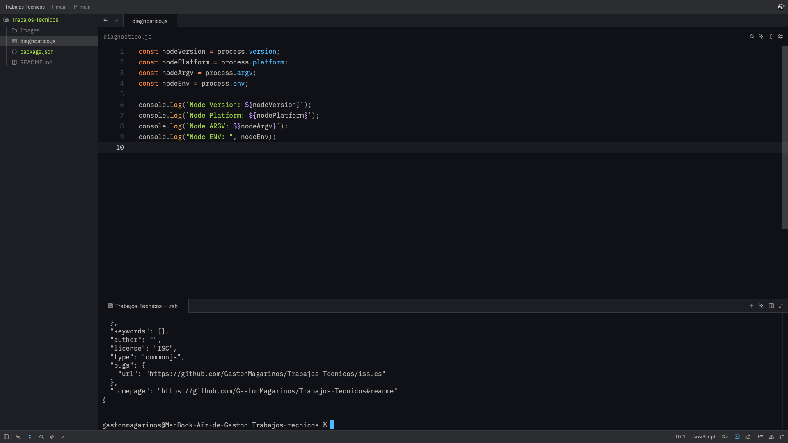
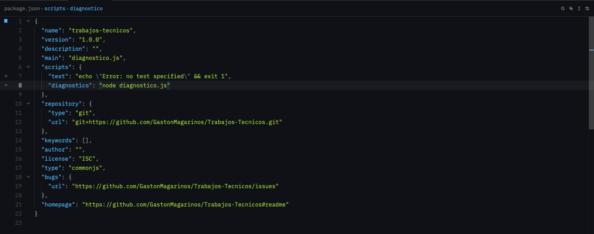
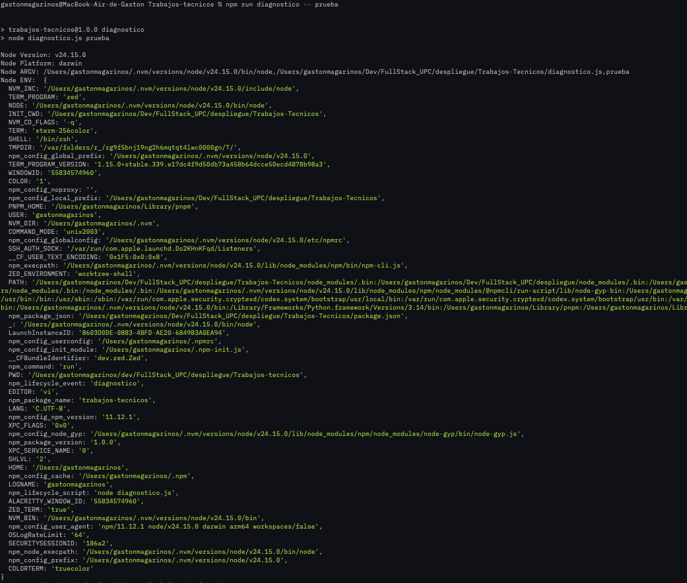

# Trabajos-Tecnicos

Este es la primer prueba tecnica de Diseño y Arquitectura de Despliegue I

Alumno:Gaston Magariños Chavez

Profesor: Christian Lucas Di Guardia

---

## Resumen

En esta prueba tecnica, decidi leer la documentacion de la propiedad process en node(bibliografia adjunta a lo ultimo del README),y la manera en la que decidi desarrollar la prueba, fue la siguiente.

Crear constantes para almacenar los valores y despues utilizar console.log() para mostrar los valores en la terminal, con las leyendas utilizando template strings en vez de la concatenacion de strings.

## Primer paso

### Creamos el archivo diagnostico.js y armamos el codigo

### Ejecutamos el archivo diagnostico.js con el comando node diagnostico.js

## Segundo paso

### Utilizamos npm init -y para crear package.json

### Agregamos a scripts dentro de package.json "diagnostico": "node diagnostico.js"

### Ejecutamos npm diagnostico - - prueba

---

# Commits incrementales

| Nro.Orden | Hash Commit   | Descripción                                                                      |
| --------- | ------------- | -------------------------------------------------------------------------------- |
| 1         | 1959087       | Initial commit                                                                   |
| 2         | cdccbc6       | Creacion del archivo diagnostico.js y ejecucion con node                         |
| 3         | f3459e5       | Creacion de package.json,configuracion de scripts y ejecucion del codigo con npm |
| 7         | Actual commit | Creacion del README                                                              |

Esta informacion es sacada del comando git log --oneline.Debido a que cuando hago el commit no puedo adjuntar este ultimo, lo coloco como actual commit.

---

## Bibliografía:

Node: https://nodejs.org/api/process.html
